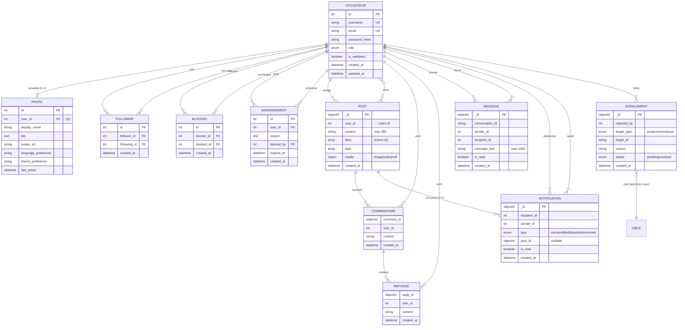

# Breezy — Dictionnaire des données & MCD

> Modèle de données de la plateforme Breezy.
> Architecture **polyglotte** (persistance hybride) :
> - **PostgreSQL** (Sequelize) — identité, relations sociales, modération structurée : `Users`, `Profiles`, `Followers`, `Bans`, `BlockedUsers`.
> - **MongoDB** (Mongoose) — contenu à fort volume / structure imbriquée : `posts`, `directmessages`, `notifications`, `reports`.
>
> Les deux bases sont reliées par des **références logiques** : les documents Mongo référencent l'identifiant numérique `Users.id` (PostgreSQL) via des champs `user_id`, `sender_id`, `recipient_id`, `reported_by`, etc. Ces liens **ne sont pas des clés étrangères contraintes** (frontière inter-SGBD) — l'intégrité est garantie au niveau applicatif.

---

## 1. Dictionnaire des données

Conventions :
- **Type physique** = type tel que déclaré dans le SGBD (Sequelize / Mongoose).
- **N?** = la colonne accepte-t-elle `NULL` (Oui) ou est-elle obligatoire (Non).
- **Clé** : PK = clé primaire, FK = clé étrangère, UQ = contrainte d'unicité, IX = indexé.

### 1.1 PostgreSQL

#### Table `Users` — comptes utilisateurs (entité racine de l'identité)

| Champ | Type physique | N? | Clé | Défaut | Description |
|---|---|---|---|---|---|
| `id` | INTEGER | Non | PK, auto-incrément | séquence | Identifiant unique du compte. Référencé par toutes les autres entités. |
| `username` | VARCHAR(50) | Non | UQ | — | Identifiant public (`@pseudo`). Stocké en minuscules. Règles applicatives : 3–30 car., `[a-z0-9_.]`, ni `.`/`_` en début/fin, pas de `..`, pseudos réservés interdits. |
| `email` | VARCHAR(255) | Non | UQ | — | Adresse e-mail de connexion. Validée (format + max 254 car. côté applicatif). |
| `password_hash` | VARCHAR(255) | Non | — | — | Empreinte bcrypt du mot de passe. Le mot de passe en clair n'est jamais stocké. |
| `role` | ENUM('user','moderator','admin') | Non | — | `'user'` | Rôle / niveau de privilège. |
| `is_validated` | BOOLEAN | Non | — | `true` | Compte validé / actif. |
| `created_at` | TIMESTAMP | Non | — | `CURRENT_TIMESTAMP` | Date de création du compte. |
| `updated_at` | TIMESTAMP | Non | — | `CURRENT_TIMESTAMP` | Date de dernière modification. |

#### Table `Profiles` — informations de profil (1–1 avec `Users`)

| Champ | Type physique | N? | Clé | Défaut | Description |
|---|---|---|---|---|---|
| `id` | INTEGER | Non | PK, auto-incrément | séquence | Identifiant du profil. |
| `user_id` | INTEGER | Non | FK → `Users.id`, UQ | — | Compte propriétaire. **ON DELETE CASCADE / ON UPDATE CASCADE**. Unique ⇒ relation 1–1. |
| `display_name` | VARCHAR(100) | Oui | — | `NULL` | Nom d'affichage. |
| `bio` | TEXT | Oui | — | `NULL` | Biographie / description. |
| `avatar_url` | VARCHAR(500) | Oui | — | `NULL` | URL de la photo de profil. |
| `language_preference` | VARCHAR(10) | Non | — | `'en'` | Langue de l'interface (`fr` / `en` / `es`). |
| `theme_preference` | VARCHAR(20) | Non | — | `'light'` | Thème (`light` / `dark`). |
| `last_active` | TIMESTAMP | Oui | — | `NULL` | Dernière activité (présence). |

*Pas de colonnes `timestamps` Sequelize sur cette table.*

#### Table `Followers` — relation d'abonnement (réflexive sur `Users`)

| Champ | Type physique | N? | Clé | Défaut | Description |
|---|---|---|---|---|---|
| `id` | INTEGER | Non | PK, auto-incrément | séquence | Identifiant de la relation. |
| `follower_id` | INTEGER | Non | FK → `Users.id` | — | Utilisateur qui suit. **ON DELETE/UPDATE CASCADE**. |
| `following_id` | INTEGER | Non | FK → `Users.id` | — | Utilisateur suivi. **ON DELETE/UPDATE CASCADE**. |
| `created_at` | TIMESTAMP | Non | — | `CURRENT_TIMESTAMP` | Date de l'abonnement. |

**Contrainte d'unicité** `unique_follower_following` sur (`follower_id`, `following_id`) — empêche les doublons d'abonnement.

#### Table `BlockedUsers` — blocages entre utilisateurs (réflexive sur `Users`)

| Champ | Type physique | N? | Clé | Défaut | Description |
|---|---|---|---|---|---|
| `id` | INTEGER | Non | PK, auto-incrément | séquence | Identifiant du blocage. |
| `blocker_id` | INTEGER | Non | FK → `Users.id` | — | Utilisateur qui bloque. **ON DELETE/UPDATE CASCADE**. |
| `blocked_id` | INTEGER | Non | FK → `Users.id` | — | Utilisateur bloqué. **ON DELETE/UPDATE CASCADE**. |
| `created_at` | TIMESTAMP | Non | — | `CURRENT_TIMESTAMP` | Date du blocage. |

**Contrainte d'unicité** `unique_blocker_blocked` sur (`blocker_id`, `blocked_id`).

#### Table `Bans` — bannissements (action de modération)

| Champ | Type physique | N? | Clé | Défaut | Description |
|---|---|---|---|---|---|
| `id` | INTEGER | Non | PK, auto-incrément | séquence | Identifiant du bannissement. |
| `user_id` | INTEGER | Non | FK → `Users.id` | — | Utilisateur banni. **ON DELETE/UPDATE CASCADE**. |
| `reason` | TEXT | Non | — | — | Motif du bannissement. |
| `banned_by` | INTEGER | Non | FK → `Users.id` | — | Modérateur / admin auteur. **ON DELETE/UPDATE CASCADE**. |
| `expires_at` | TIMESTAMP | Oui | — | `NULL` | Fin du bannissement (`NULL` = permanent). |
| `created_at` | TIMESTAMP | Non | — | `CURRENT_TIMESTAMP` | Date du bannissement. |

---

### 1.2 MongoDB

> Toutes les collections ont une clé primaire technique `_id` (ObjectId) générée automatiquement.
> Les champs `*_id` numériques (`user_id`, `sender_id`, …) sont des **références logiques vers `Users.id`** (PostgreSQL).

#### Collection `posts` — publications

| Champ | Type physique | N? | Clé | Défaut | Description |
|---|---|---|---|---|---|
| `_id` | ObjectId | Non | PK | auto | Identifiant du post. |
| `user_id` | Number | Non | IX, → `Users.id` | — | Auteur de la publication. |
| `content` | String | Non | — | — | Texte du post. **Max 280 caractères**. |
| `likes` | [Number] | Non | — | `[]` | Liste des `Users.id` ayant aimé (relation N–N « aime »). |
| `comments` | [Comment] | Non | — | `[]` | Commentaires imbriqués (voir 1.3). |
| `tags` | [String] | Non | IX | `[]` | Hashtags associés. |
| `media` | PostMedia \| null | Oui | — | `null` | Média joint (voir 1.3). |
| `created_at` | Date | Non | IX | `Date.now` | Date de publication. |

**Index composés** : `{ user_id: 1, created_at: -1 }` (fil d'un utilisateur), `{ tags: 1, created_at: -1 }` (recherche par tag).

#### Collection `directmessages` — messages privés

| Champ | Type physique | N? | Clé | Défaut | Description |
|---|---|---|---|---|---|
| `_id` | ObjectId | Non | PK | auto | Identifiant du message. |
| `conversation_id` | String | Non | IX | — | Identifiant déterministe de la conversation (paire d'utilisateurs). |
| `sender_id` | Number | Non | → `Users.id` | — | Expéditeur. |
| `recipient_id` | Number | Non | → `Users.id` | — | Destinataire. |
| `message_text` | String | Non | — | — | Contenu du message. **Max 1000 caractères** (validation applicative). |
| `is_read` | Boolean | Non | — | `false` | Message lu par le destinataire. |
| `created_at` | Date | Non | — | `Date.now` | Date d'envoi. |

**Index composés** : `{ conversation_id: 1, created_at: -1 }` (fil d'une conversation), `{ recipient_id: 1, is_read: 1 }` (messages non lus).

#### Collection `notifications` — notifications

| Champ | Type physique | N? | Clé | Défaut | Description |
|---|---|---|---|---|---|
| `_id` | ObjectId | Non | PK | auto | Identifiant de la notification. |
| `recipient_id` | Number | Non | IX, → `Users.id` | — | Destinataire de la notification. |
| `sender_id` | Number | Non | → `Users.id` | — | Utilisateur à l'origine de l'événement. |
| `type` | String (enum) | Non | — | — | `mention` \| `like` \| `follow` \| `dm` \| `comment`. |
| `post_id` | ObjectId | Oui | ref `posts` | `null` | Post concerné (le cas échéant). |
| `is_read` | Boolean | Non | IX | `false` | Notification lue. |
| `created_at` | Date | Non | — | `Date.now` | Date de l'événement. |

**Index composés** : `{ recipient_id: 1, is_read: 1 }`, `{ recipient_id: 1, created_at: -1 }`.

#### Collection `reports` — signalements (modération)

| Champ | Type physique | N? | Clé | Défaut | Description |
|---|---|---|---|---|---|
| `_id` | ObjectId | Non | PK | auto | Identifiant du signalement. |
| `reported_by` | Number | Non | → `Users.id` | — | Utilisateur signalant. |
| `target_type` | String (enum) | Non | — | — | Type de cible : `post` \| `comment` \| `user`. |
| `target_id` | String | Non | IX | — | Identifiant de la cible (ObjectId de post/commentaire **ou** `Users.id` sérialisé en chaîne). |
| `reason` | String | Non | — | — | Motif du signalement. |
| `status` | String (enum) | Non | IX | `'pending'` | État : `pending` \| `resolved`. |
| `created_at` | Date | Non | — | `Date.now` | Date du signalement. |

**Index composé** : `{ status: 1, created_at: -1 }` (file d'attente de modération).

---

### 1.3 Sous-documents imbriqués (MongoDB)

Ces structures n'existent pas en tant que collections : elles sont **embarquées** dans `posts` (pas d'`_id` propre, sauf l'identifiant métier indiqué).

#### `Comment` (imbriqué dans `posts.comments`)

| Champ | Type physique | N? | Défaut | Description |
|---|---|---|---|---|
| `comment_id` | ObjectId | Non | auto | Identifiant métier du commentaire. |
| `user_id` | Number | Non | — | Auteur du commentaire (→ `Users.id`). |
| `content` | String | Non | — | Texte du commentaire (max 280 car. côté applicatif). |
| `created_at` | Date | Non | `Date.now` | Date du commentaire. |
| `replies` | [Reply] | Non | `[]` | Réponses imbriquées. |

#### `Reply` (imbriqué dans `Comment.replies`)

| Champ | Type physique | N? | Défaut | Description |
|---|---|---|---|---|
| `reply_id` | ObjectId | Non | auto | Identifiant métier de la réponse. |
| `user_id` | Number | Non | — | Auteur de la réponse (→ `Users.id`). |
| `content` | String | Non | — | Texte de la réponse. |
| `created_at` | Date | Non | `Date.now` | Date de la réponse. |

#### `PostMedia` (imbriqué dans `posts.media`)

| Champ | Type physique | N? | Description |
|---|---|---|---|
| `type` | String (enum) | Non | `image` \| `video`. |
| `url` | String | Non | URL du média stocké. |

---

### 1.4 Règles de validation applicatives (couche service)

Contrôles appliqués avant insertion, en complément des contraintes SGBD :

| Donnée | Règles |
|---|---|
| **username** | 3–30 caractères ; jeu `[a-z0-9_.]` (minuscules) ; ne commence/finit pas par `.` ou `_` ; pas de `..` ; pseudos réservés interdits (`admin`, `root`, `support`, `breezy`, `moderator`). |
| **email** | Format `local@domaine.tld`, sans espace ; ≤ 254 caractères ; trim. |
| **password** | 8–128 caractères ; au moins 1 minuscule, 1 majuscule, 1 chiffre, 1 caractère spécial. Jamais stocké en clair (bcrypt). |
| **contenu post** | Obligatoire, non vide, ≤ 280 caractères. |
| **contenu commentaire** | Obligatoire, non vide, ≤ 280 caractères. |
| **message privé** | `recipient_id` numérique requis ; texte requis, non vide, ≤ 1000 caractères. |
| **signalement** | `target_type`, `target_id`, `reason` (non vide) requis. |
| **bannissement** | `user_id`, `reason` (non vide) requis. |

---

## 2. MCD — Modèle Conceptuel de Données

> Vue d'ensemble du modèle (image vectorielle) :
>
> 
>
> Deux variantes du même diagramme sont disponibles dans `docs/assets/` :
> - **`mcd-portrait.svg`** — format A4 portrait, pour l'insertion dans le rapport PDF (ci-dessus) ;
> - **`mcd-slide.svg`** — format 16:9, pour une diapositive PowerPoint.
>
> Le diagramme met en évidence la frontière polyglotte (PostgreSQL ↔ MongoDB) : trait plein = clé étrangère réelle, trait orange/pointillé = référence logique inter-bases (`Users.id`), losange = composition (sous-document imbriqué).

### 2.1 Entités

| Entité | Support | Rôle |
|---|---|---|
| **UTILISATEUR** | PG `Users` | Compte / identité racine. |
| **PROFIL** | PG `Profiles` | Données de profil (1–1 avec UTILISATEUR). |
| **POST** | Mongo `posts` | Publication. |
| **COMMENTAIRE** | Mongo (imbriqué) | Commentaire d'un post (entité faible). |
| **REPONSE** | Mongo (imbriqué) | Réponse à un commentaire (entité faible). |
| **MESSAGE** | Mongo `directmessages` | Message privé. |
| **NOTIFICATION** | Mongo `notifications` | Notification d'événement. |
| **SIGNALEMENT** | Mongo `reports` | Signalement de contenu/utilisateur. |
| **BANNISSEMENT** | PG `Bans` | Sanction de modération (porteuse d'attributs). |

### 2.2 Associations & cardinalités (notation Merise *(min, max)*)

| Association | Entités reliées | Cardinalités | Attributs portés |
|---|---|---|---|
| **POSSEDE** | UTILISATEUR — PROFIL | UTILISATEUR (1,1) — (0,1) PROFIL | — |
| **SUIT** | UTILISATEUR — UTILISATEUR (réflexive) | suiveur (0,n) — (0,n) suivi | `created_at` (table `Followers`) |
| **BLOQUE** | UTILISATEUR — UTILISATEUR (réflexive) | bloqueur (0,n) — (0,n) bloqué | `created_at` (table `BlockedUsers`) |
| **REDIGE** | UTILISATEUR — POST | UTILISATEUR (0,n) — (1,1) POST | — |
| **AIME** | UTILISATEUR — POST | UTILISATEUR (0,n) — (0,n) POST | — (tableau `likes`) |
| **CONTIENT (post→com.)** | POST — COMMENTAIRE | POST (1,1) — (0,n) COMMENTAIRE | composition (entité faible) |
| **ECRIT_COM** | UTILISATEUR — COMMENTAIRE | UTILISATEUR (0,n) — (1,1) COMMENTAIRE | — |
| **CONTIENT (com.→rép.)** | COMMENTAIRE — REPONSE | COMMENTAIRE (1,1) — (0,n) REPONSE | composition (entité faible) |
| **ECRIT_REP** | UTILISATEUR — REPONSE | UTILISATEUR (0,n) — (1,1) REPONSE | — |
| **ENVOIE** | UTILISATEUR — MESSAGE | expéditeur (0,n) — (1,1) MESSAGE | — |
| **RECOIT_MSG** | UTILISATEUR — MESSAGE | destinataire (0,n) — (1,1) MESSAGE | — |
| **DECLENCHE** | UTILISATEUR — NOTIFICATION | émetteur (0,n) — (1,1) NOTIFICATION | — |
| **RECOIT_NOTIF** | UTILISATEUR — NOTIFICATION | destinataire (0,n) — (1,1) NOTIFICATION | `type`, `is_read` |
| **CONCERNE** | NOTIFICATION — POST | NOTIFICATION (0,1) — (0,n) POST | — (optionnel) |
| **EMET_SIGN** | UTILISATEUR — SIGNALEMENT | signalant (0,n) — (1,1) SIGNALEMENT | `target_type`, `reason`, `status` |
| **CIBLE** | SIGNALEMENT — (POST/COMMENTAIRE/UTILISATEUR) | SIGNALEMENT (1,1) — (0,n) cible | cible polymorphe via `target_type`/`target_id` |
| **SUBIT** | UTILISATEUR — BANNISSEMENT | banni (0,n) — (1,1) BANNISSEMENT | `reason`, `expires_at` |
| **PRONONCE** | UTILISATEUR — BANNISSEMENT | modérateur (0,n) — (1,1) BANNISSEMENT | — |

> Remarques :
> - **SUIT** et **BLOQUE** sont des associations réflexives porteuses (CIF) matérialisées par les tables `Followers` / `BlockedUsers` — contrainte d'unicité sur le couple ordonné pour éviter les doublons.
> - **BANNISSEMENT** joue deux rôles distincts vers UTILISATEUR (le banni `user_id`, l'auteur `banned_by`).
> - **CIBLE** est une association **polymorphe** : le couple (`target_type`, `target_id`) désigne un post, un commentaire ou un utilisateur — non contraignable par une FK classique.
> - COMMENTAIRE et REPONSE sont des **entités faibles** (composition) : elles n'existent pas hors de leur post / commentaire parent (documents imbriqués MongoDB).

### 2.3 Diagramme entité-association (Mermaid)

> **Note de lecture** : les entités à gauche du trait (`UTILISATEUR`, `PROFIL`, `FOLLOWER`, `BLOCKED`, `BANNISSEMENT`) vivent dans **PostgreSQL** ; `POST`, `COMMENTAIRE`, `REPONSE`, `MESSAGE`, `NOTIFICATION`, `SIGNALEMENT` vivent dans **MongoDB**. Les liens inter-bases (UTILISATEUR ↔ entités Mongo) sont des **références logiques** par `Users.id`, non des clés étrangères physiques.
